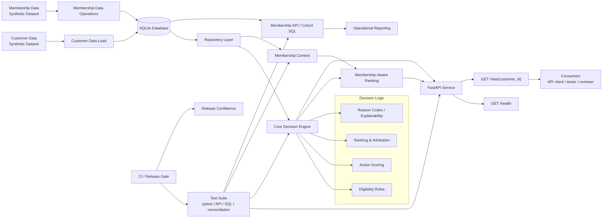

# Next Best Action Decisioning Lab

A synthetic banking decisioning and data-operations lab demonstrating QA engineering, test automation, SQL validation, API testing, decision-system validation, membership analytics, model-output validation, integration testing, and automated release readiness.

The project contains no real customer information, proprietary banking data, or production decision logic.

---

## Architecture Overview

The Next Best Action Decisioning Lab is structured as a testable decisioning system.

Synthetic customer data and membership-domain data are stored in SQLite, accessed through repository layers, evaluated by decisioning logic, and exposed through a FastAPI service.

The architecture supports:

- rule validation
- eligibility enforcement
- action scoring
- ranking and arbitration
- reason-code explainability
- membership-context enrichment
- SQL analytics
- API-level validation
- reconciliation
- release gating



---

## Engineering Scope

- 20,000 synthetic customer profiles
- SQLite-backed customer repository
- FastAPI decisioning API
- independent business-rule validation
- API contract and negative testing
- data-quality and pipeline validation
- database-to-API reconciliation
- full-population batch reconciliation
- upstream and downstream data-flow validation
- eligibility and constraint enforcement
- Pega-inspired candidate arbitration
- synthetic propensity-model validation
- model-to-decision integration
- GitHub Actions regression workflow
- automated fail-closed release validation
- JUnit evidence generation
- synthetic membership and subscription data operations
- membership lifecycle event processing
- engagement-event processing
- benefit-redemption validation
- campaign interaction processing
- marketing-consent reconciliation
- membership SQL KPI analytics
- cohort retention analytics
- operational membership reporting
- membership-aware Next Best Action ranking
- optional membership-schema compatibility

---

## Membership Data Operations

The lab includes a synthetic Membership Data Operations capability integrated with the banking Next Best Action environment.

The membership domain covers:

- members
- subscriptions
- membership lifecycle events
- engagement activity
- benefit redemptions
- campaign interactions
- marketing-consent integrity
- source-to-database reconciliation
- data-quality validation
- SQL KPI analytics
- cohort retention analysis
- operational reporting
- membership-aware decision ranking

The validated synthetic environment contains:

```text
Customers              20,000
Members                 13,856
Subscriptions           15,559
Membership events       42,169
Engagement events       79,791
Benefit redemptions     32,379
Campaign interactions   24,248
```

Membership status distribution:

```text
ACTIVE       11,051
CANCELLED     1,223
INACTIVE      1,081
SUSPENDED       501
```

Membership tier distribution:

```text
STANDARD      6,162
PLUS          6,031
PREMIUM       1,663
```

Membership context may influence the relevance of an already eligible action, but it cannot create eligibility or override existing banking consent, eligibility, or product controls.

Customers without membership records continue through the original decisioning path unchanged.

Detailed validation evidence:

- [Membership Data Operations Validation](docs/validation/Membership_Data_Operations_Validation.md)

---

## Current Validation Baseline

**360 automated tests passing**

The release-validation process includes:

- critical release-readiness smoke tests
- complete automated regression
- machine-readable JUnit evidence
- non-zero exit codes on mandatory validation failure
- explicit `PASS` or `BLOCKED` release decisions

Latest validated release result:

```text
Stage 1 - Release Readiness Smoke Validation
10 passed

Stage 2 - Complete Regression Validation
360 passed

RELEASE RESULT: PASS
Smoke exit code      : 0
Regression exit code : 0
```

Controlled defect experiments have also been used to verify that automated validation can detect failures in:

- business rules
- API contracts
- upstream consent mapping
- downstream decision mapping
- eligibility enforcement
- decision constraints
- propensity-model output ranges
- model behavioural expectations
- membership data quality
- membership decision integration
- release-readiness gates

---

## Focus

Banking decisioning, membership data operations, data validation, API testing, SQL reconciliation, decision-system validation, model-output validation, integration testing, regression automation, analytics validation, and release readiness.

---

## Technologies

- Python
- FastAPI
- SQLite
- SQL
- pytest
- Pydantic
- Git
- GitHub Actions
- CI/CD
- PowerShell

---

## Key Engineering Work

- Rule-based eligibility, scoring, and action ranking
- Five candidate Next Best Actions
- Reason-code generation for decision explainability
- 20,000 synthetic customer profiles
- SQLite-backed customer repository
- Database-to-API reconciliation
- Positive and negative API validation
- Data-quality and pipeline validation
- Full-population decision reconciliation
- Upstream and downstream data transformation
- Consent-integrity validation
- Pega-inspired eligibility and candidate arbitration
- Propensity-model output validation
- Model-version and feature traceability
- Automated regression testing
- GitHub Actions CI validation
- Automated release-readiness validation
- Fail-closed release gating
- JUnit evidence generation
- Controlled data-layer migration from CSV to SQLite
- Git-based baseline and feature-branch workflow
- Membership schema and synthetic data pipeline
- Membership source-to-database reconciliation
- Membership lifecycle event processing
- Membership engagement event processing
- Benefit-redemption validation
- Campaign interaction validation
- Customer-authoritative marketing-consent validation
- SQL KPI analytics
- Cohort-retention analytics
- Business-facing membership operational reporting
- Optional membership-context enrichment
- Membership-aware NBA relevance ranking
- Real-database member and non-member API validation

---

## Decisioning Architecture

- [Next Best Action Decisioning — Architecture](architecture/next-best-action-decisioning.md)

High-level flow:

```text
Synthetic customer data
        |
        v
SQLite customer repository
        |
        v
Upstream data mapping
        |
        v
Customer / consent validation
        |
        v
Eligibility and constraints
        |
        v
Base action scoring
        |
        +-----------------------------+
        |                             |
        v                             v
Customer has membership?        No membership
        |                             |
       Yes                            |
        |                             |
        v                             |
Membership context                   |
        |                             |
        v                             |
Membership relevance adjustment      |
        |                             |
        +-------------+---------------+
                      |
                      v
Candidate ranking
        |
        v
Next Best Action
        |
        v
Downstream decision mapping
        |
        v
FastAPI endpoint
        |
        v
Automated validation
        |
        v
Release readiness gate
```

---

## Next Best Action Flow

The lab evaluates customer information against multiple candidate actions.

Examples include:

- `SAVINGS_PLAN`
- `INVESTMENT_INFO`
- `MORTGAGE_CONSULTATION`
- `CREDIT_CARD_UPGRADE`
- `FINANCIAL_HEALTH_CHECK`

Each action can be evaluated using:

- eligibility
- constraints
- customer characteristics
- reason codes
- propensity
- context weighting
- business value
- business levers
- deterministic priority

The resulting candidates are ranked and a single Next Best Action is selected.

---

## Membership-Aware Decisioning

Membership decisioning is implemented separately from the core banking eligibility logic.

The membership context includes:

```text
member_id
membership_status
membership_tier
tenure_days
engagement_events_30d
successful_benefit_redemptions_30d
campaign_sends_30d
campaign_conversions_30d
latest_campaign_response
```

Current membership relevance signals include:

```text
Recent membership engagement
Recent campaign conversion
Recent campaign click
Recent campaign open
```

Current synthetic relevance adjustments include:

```text
Recent membership engagement       +0.03
Recent campaign conversion         +0.04
Recent campaign click              +0.02
Recent campaign open               +0.01
```

These adjustments are applied only to eligible actions.

Membership information must never:

- make an ineligible action eligible
- override marketing consent
- override investment consent
- override existing product rules
- bypass financial eligibility controls

Membership tier, tenure, and benefit utilisation are not used as proxies for financial suitability.

The membership adjustment values are synthetic lab policies and do not represent production banking rules.

---

## Membership Repository Context

The repository layer derives membership context directly from SQLite.

The implementation uses independent correlated subqueries for:

- engagement events
- benefit redemptions
- campaign sends
- campaign conversions
- latest campaign response

This avoids accidental row multiplication that can occur when several one-to-many event tables are joined together before aggregation.

The current membership analytics snapshot uses:

```text
2026-09-21
```

The trailing 30-day window is inclusive:

```text
2026-08-23 through 2026-09-21
```

Future events are excluded from the decisioning context.

---

## Optional Membership Schema Safety

Membership enrichment is optional from the perspective of the original banking API.

Before membership SQL is executed, the repository checks for the required tables:

```text
members
engagement_events
benefit_redemptions
campaign_interactions
```

If the membership schema does not exist:

```text
get_membership_context(...)
```

returns:

```text
None
```

The customer then continues through the original Next Best Action decisioning flow.

This allows customer-only environments and CI databases to remain compatible with the membership-aware API.

---

## Membership KPIs

The membership analytics layer supports:

- total members
- active members
- new members
- active subscriptions
- renewal rate
- churn rate
- retention rate
- 30-day engagement rate
- benefit-redemption rate
- tier distribution
- upgrades
- downgrades
- recurring subscription revenue
- campaign conversion rate
- consent mismatch reporting

The KPI definitions are documented in:

```text
docs/kpi_definitions.md
```

The SQL implementation is maintained in:

```text
sql/membership_kpis.sql
```

Example validated results:

```text
Total members                         13,856
Active members                        11,051
New members - 30 days                    224

Active subscriptions                  11,552
Realised renewal rate                  75.30%

Churn rate                              0.94%
Retention rate                         99.06%

Engagement rate                        70.25%
Benefit redemption rate               33.17%

Upgrades - 30 days                        65
Downgrades - 30 days                       0

Monthly recurring revenue        EUR 201,154.48

Campaign sends - 30 days               4,563
Campaign conversions - 30 days           218
Campaign conversion rate                4.78%

Consent mismatches                       207
Opt-out campaign violations                0
```

Monthly recurring revenue is a modeled analytical KPI and is not presented as accounting or cash-receipt data.

---

## Cohort Retention Analytics

Membership cohorts are based on calendar month of join date.

The SQL implementation is maintained in:

```text
sql/membership_cohorts.sql
```

Retention is evaluated using cohort-relative monthly checkpoints.

Example validated cohort:

```text
2025-09 cohort
```

Observed retention:

```text
Month 0      233 / 233     100.00%
Month 1      228            97.85%
Month 2      225            96.57%
Month 3      224            96.14%
Month 4      222            95.28%
Month 5      219            93.99%
Month 6      212            90.99%
Month 7      210            90.13%
Month 8      207            88.84%
Month 9      202            86.70%
Month 10     193            82.83%
Month 11     190            81.55%
Month 12     187            80.26%
```

Automated cohort validation covers:

- exclusion of future cohorts
- Month-0 population
- retention curves
- exact checkpoint handling
- current-month as-of-date capping
- immature milestone handling
- mature milestone calculation
- recent cohort summaries
- monotonic retention behaviour
- cohort ranking

---

## Operational Membership Reporting

The operational reporting layer consolidates:

- membership population
- active membership
- subscriptions
- renewal
- churn
- retention
- engagement
- benefit utilisation
- tier distribution
- campaign performance
- recurring revenue
- cohort metrics
- data-quality exceptions

The report generator is:

```text
src/generate_membership_operational_report.py
```

Generated reports are written under:

```text
reports/membership/
```

Generated reports are intentionally excluded from Git.

---

## Pega-Inspired Arbitration

The project contains a dedicated arbitration layer for validating how eligible actions compete for selection.

The simplified engineering model uses:

```text
Arbitration Score
=
Propensity
× Context Weight
× Business Value
× Business Lever
```

Eligibility and constraints remain authoritative.

A high score cannot make an ineligible or blocked action selectable.

Deterministic tie-breaking is also validated to ensure repeatable decisions.

---

## Propensity Model Validation

A synthetic investment-propensity model is included to demonstrate QA techniques for model-assisted decisioning.

Validation covers:

- score range between `0.0` and `1.0`
- deterministic prediction
- model-version traceability
- input-feature traceability
- savings monotonicity
- monthly-surplus monotonicity
- digital-engagement monotonicity
- invalid-input rejection
- eligibility protection
- arbitration integration

The model is intentionally synthetic and is used for testing decision-system behaviour rather than representing a production banking model.

---

## Data-Flow Validation

The project validates information across differently structured upstream and downstream systems.

Example upstream mapping:

```text
party_id                  -> customer_id
income_monthly_eur        -> monthly_income
savings_eur               -> savings_balance
marketing_permission      -> marketing_consent
preferred_contact_channel -> preferred_channel
```

Boolean-style values such as:

```text
Y -> True
N -> False
```

are explicitly validated.

The downstream layer also verifies that:

- the selected action is preserved
- score is preserved
- eligibility is preserved
- reason codes are preserved
- candidate ranking is preserved

This provides coverage across system boundaries rather than validating the decision engine in isolation.

---

## SQLite Data Layer

Synthetic customer and membership records are stored in SQLite.

The repository layer uses parameterized SQL queries to retrieve customer and membership data before decisioning.

The generated database is local and is not committed to the repository.

To generate the base synthetic customer dataset:

```powershell
python -m src.synthetic_data
```

To build the base SQLite customer database:

```powershell
python -m src.load_customers_to_sqlite
```

Membership-specific tests use isolated membership fixtures where appropriate.

---

## API

Start the FastAPI application from the repository root:

```powershell
uvicorn src.app:app --reload
```

The local service exposes:

```text
GET /health
GET /nba/{customer_id}
```

Example valid customer identifier:

```text
C00001
```

The customer-ID contract uses:

```text
C#####
```

Malformed identifiers are rejected by API validation.

The NBA endpoint performs:

```text
get_customer(customer_id)
        |
        v
get_membership_context(customer_id)
        |
        v
MembershipContext or None
        |
        v
decide_with_membership(...)
        |
        v
NBAResponse
```

---

## Real Database API Smoke Validation

A post-integration smoke test was executed using actual synthetic records from the generated SQLite database.

Member path:

```text
Customer                    C00005
Membership status           ACTIVE
Membership tier             STANDARD
Engagement events - 30d     2
Campaign conversions - 30d  0
HTTP status                 200
Next Best Action            FINANCIAL_HEALTH_CHECK
Score                       0.36
Reason                      LOW_EMERGENCY_SAVINGS
```

This demonstrates that membership existence alone does not automatically change a recommendation.

Non-member path:

```text
Customer                    C00001
Membership context          None
HTTP status                 200
Next Best Action            SAVINGS_PLAN
Score                       0.52
```

Result:

```text
REAL DATABASE API SMOKE TEST: PASS
```

---

## Automated Testing

Run the complete regression suite:

```powershell
python -m pytest -q
```

Current validated baseline:

```text
360 passed
```

The test suite covers:

- business-rule validation
- customer repository behaviour
- API contract validation
- negative API testing
- data-quality validation
- database reconciliation
- upstream/downstream mapping
- arbitration
- propensity validation
- release readiness
- load and concurrency validation
- membership ingestion
- membership lifecycle events
- engagement events
- benefit redemptions
- campaign interactions
- consent integrity
- KPI analytics
- cohort retention
- operational reporting
- membership context retrieval
- membership-aware ranking
- optional membership-schema handling
- member API integration
- non-member API compatibility

A known Starlette/AnyIO dependency deprecation warning may also appear. It does not currently affect test execution.

---

## CI Regression Validation

The repository contains a GitHub Actions workflow that automatically:

1. checks out the repository
2. configures Python
3. installs dependencies
4. generates synthetic customer data
5. builds the SQLite customer database
6. executes the complete pytest regression suite
7. generates JUnit evidence
8. uploads the regression artifact

The workflow runs on relevant pushes and pull requests.

Membership-specific tests construct isolated membership fixtures where required.

The optional membership-schema handling preserves compatibility with the customer-only CI database.

---

## Release Readiness Validation

A dedicated PowerShell release-validation runner provides a two-stage automated release gate.

Run:

```powershell
.\scripts\run_release_validation.ps1
```

### Stage 1 — Release Readiness Smoke Validation

Critical cross-layer checks validate:

- API health and version
- malformed API-input rejection
- customer-identity preservation
- marketing-consent integrity
- propensity-model output contract
- model-version traceability
- arbitration eligibility protection
- downstream Next Best Action preservation
- deterministic decision behaviour

Latest validated result:

```text
10 passed
Smoke exit code: 0
```

### Stage 2 — Full Regression

If the smoke gate passes, the complete automated regression suite is executed.

Latest validated result:

```text
360 passed
Regression exit code: 0
```

A healthy release produces:

```text
RELEASE RESULT: PASS
Smoke exit code      : 0
Regression exit code : 0
```

A mandatory smoke failure produces:

```text
RELEASE RESULT: BLOCKED
Exit code: 1
```

This provides fail-closed release behaviour suitable for CI/CD integration.

---

## Full-Population Reconciliation

The project includes sequential reconciliation of the database population against API decision results.

The verified synthetic customer dataset contains:

```text
20,000 customers
```

A complete reconciliation run produced:

```text
Checked:     20,000
Passed:      20,000
Failed:      0
Match rate:  100%
```

This is functional volume validation rather than concurrent load testing.

Large-scale 100K/1M-customer and concurrent traffic testing are maintained as separate performance-testing concerns.

---

## Validation Documentation

The project includes documented validation evidence covering the major QA layers of the decisioning system:

- [SQLite Data Layer Validation](docs/validation/SQLite_Data_Layer_Validation.md)
- [Independent Business-Rule Validation](docs/validation/Business_Rule_Validation.md)
- [Data Quality and Pipeline Validation](docs/validation/Data_Quality_and_Pipeline_Validation.md)
- [API Contract and Negative Testing](docs/validation/API_Contract_and_Negative_Testing.md)
- [Batch Reconciliation Validation](docs/validation/Batch_Reconciliation_Validation.md)
- [CI Regression Workflow Validation](docs/validation/CI_Regression_Workflow_Validation.md)
- [Data-Flow Integration Validation](docs/validation/Data_Flow_Integration_Validation.md)
- [Decision Arbitration Validation](docs/validation/Decision_Arbitration_Validation.md)
- [Propensity Model Validation](docs/validation/Propensity_Model_Validation.md)
- [Release Readiness Validation](docs/validation/Release_Readiness_Validation.md)
- [API Load and Concurrency Validation](docs/validation/API_Load_and_Concurrency_Validation.md)
- [Membership Data Operations Validation](docs/validation/Membership_Data_Operations_Validation.md)

---

## Requirements Documentation

Requirements used to drive independent validation are maintained under:

```text
docs/requirements/
```

They include specifications covering:

- business rules
- data quality
- API contracts
- batch reconciliation
- CI regression
- upstream/downstream data mapping
- decision arbitration
- propensity-model behaviour
- release readiness
- membership data operations
- membership analytics
- membership and NBA integration

This allows tests to be derived from documented expectations rather than simply reproducing implementation logic.

Membership-specific requirements are documented in:

```text
docs/requirements/Membership_Data_Operations_Requirements_v1.md
```

---

## Membership Requirements Coverage

The Membership Data Operations implementation covers:

```text
MDO-001   Member identity
MDO-002   Customer-to-member relationship
MDO-003   Membership status
MDO-004   Membership tier
MDO-005   Membership dates
MDO-006   Subscription identity
MDO-007   Subscription period
MDO-008   Renewal status
MDO-009   Subscription commercial data
MDO-010   Membership lifecycle history
MDO-011   Engagement events
MDO-012   Benefit redemptions
MDO-013   Benefit eligibility validation
MDO-014   Campaign interactions
MDO-015   Marketing consent integrity
MDO-016   Duplicate detection
MDO-017   Referential integrity
MDO-018   Source-to-database reconciliation
MDO-019   Data-quality reporting
MDO-020   Membership operational KPIs
MDO-021   Cohort analysis
MDO-022   SQL analytics
MDO-023   Operational reporting
MDO-024   Next Best Action integration
MDO-025   Existing regression protection
MDO-026   Synthetic data only
```

---

## Project Structure

```text
.
├── .github/
│   └── workflows/
│       └── regression.yml
├── architecture/
├── data/
├── docs/
│   ├── requirements/
│   │   └── Membership_Data_Operations_Requirements_v1.md
│   └── validation/
│       └── Membership_Data_Operations_Validation.md
├── scripts/
│   ├── run_regression.ps1
│   └── run_release_validation.ps1
├── sql/
│   ├── membership_kpis.sql
│   └── membership_cohorts.sql
├── src/
│   ├── app.py
│   ├── arbitration.py
│   ├── batch_reconcile_db_api.py
│   ├── data_quality.py
│   ├── decision_engine.py
│   ├── downstream_adapter.py
│   ├── generate_membership_operational_report.py
│   ├── load_customers_to_sqlite.py
│   ├── membership_decisioning.py
│   ├── membership_schema.py
│   ├── models.py
│   ├── propensity_model.py
│   ├── reconcile_db_api.py
│   ├── repository.py
│   ├── synthetic_data.py
│   └── upstream_adapter.py
├── tests/
├── requirements.txt
└── pyproject.toml
```

Generated databases, membership datasets, reports, caches, and virtual environments are excluded from version control.

---

## Local Setup

Create and activate a Python virtual environment, then install project dependencies:

```powershell
python -m pip install -r requirements.txt
```

Generate the synthetic customer dataset:

```powershell
python -m src.synthetic_data
```

Build the SQLite customer database:

```powershell
python -m src.load_customers_to_sqlite
```

Run the complete automated test suite:

```powershell
python -m pytest -q
```

Start the API:

```powershell
uvicorn src.app:app --reload
```

Run release validation:

```powershell
.\scripts\run_release_validation.ps1
```

---

## Engineering Approach

The project emphasizes independent and evidence-led QA.

Validation is designed around questions such as:

- Is the source data valid?
- Was data transformed correctly between systems?
- Are business rules implemented correctly?
- Is the API contract enforced?
- Does the database agree with the API?
- Can ineligible actions ever win?
- Do model outputs remain within their defined contract?
- Does model behaviour remain consistent with expected relationships?
- Is the selected decision preserved downstream?
- Are membership records referentially valid?
- Are marketing-consent mismatches surfaced?
- Do membership KPIs reconcile to the underlying data?
- Are cohort calculations independently testable?
- Can membership context alter ranking without bypassing eligibility?
- Does the system continue to work for non-members?
- Can a critical defect automatically block release?

The aim is not only to confirm that the application runs, but to determine whether the decisioning system behaves correctly across data, API, membership, model, integration, analytics, and release boundaries.

---

## Repository Purpose

This repository is an independent engineering project demonstrating QA engineering and test-automation approaches for a synthetic banking Next Best Action and membership-data environment.

It demonstrates techniques relevant to:

- QA engineering
- test automation
- API testing
- SQL validation
- data reconciliation
- data-quality engineering
- membership data operations
- analytics validation
- decision-system testing
- model-assisted decision validation
- CI/CD
- release readiness

It contains no real customer information, subscriber information, payment data, proprietary banking data, or production decision logic.
