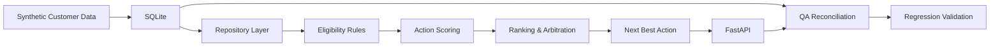

# Next Best Action Decisioning — Architecture

## Validation focus

The system is evaluated across three concerns:

**Data integrity**  
Is the correct customer record being consumed?

**Decision integrity**  
Are eligibility, score, ranking and reason codes consistent with the input?

**Regression safety**  
Can infrastructure or data-layer changes occur without altering established decision behaviour?
